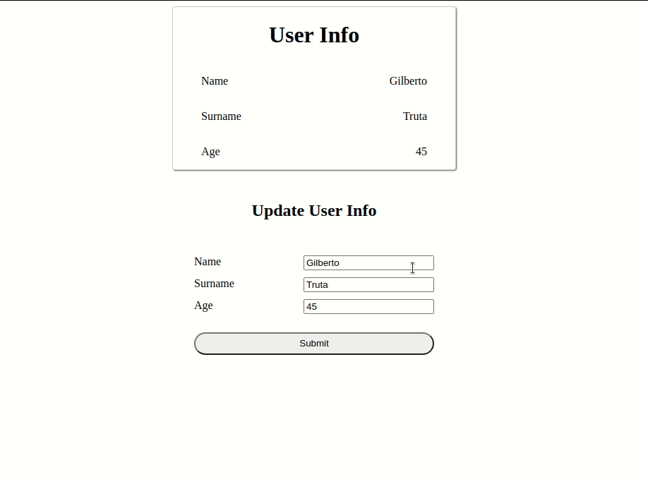

# Intro to React Components

This is an educational code for those who are entering the awesome world of programming!

In this exercise you will experience two ways of building a React component, by using:

- Functions
- Classes

## The challenge

This application collects the user input, shows it on the proper area of the screen and allows the user to click on a Submit button. By clicking on the submit button, an alert will be fired after a small delay to signal that the form has been submitted.

This is a demo application and it's incomplete. You should be able to make it work by following the instructions and using that big grey mass between your ears ;)

## Instructions

You already have a startup code, so you don't need to code from scratch... Yay!

Follow the TODO's in the comments throughout the code to get some hints.

> Take a look on the code before diving your fingers in the keyboard.

**If needed**, as in desperate situations, take a look on the "answers" branch to find out where you're getting it wrong.

### Step 0

- **Clone** this repo or **download** the .zip file;
- Run `npm install` to download the dependencies;
- Run `npm start` to execute the app;

You'll be working inside the `src > functional` and `src > oop` folders

### Step 1

Setup the component's **state** if needed and display the user info on screen:

- **name**
- **surname**
- **age**

### Step 2

Collect the user input and change the user info accordingly.

### Step 3

After clicking on the submit button, an alert should fire after a delay signalling that the form has been submitted.

## Result

This should be your result:

### Disclaimer

This code is not intended for technical interviews and neither should be used in production envivonment.

This is a brief demonstration of how to build React components using classes and functions.

### References

If you'd like to know more about React, try the [official documentation](https://reactjs.org/docs/getting-started.html).
